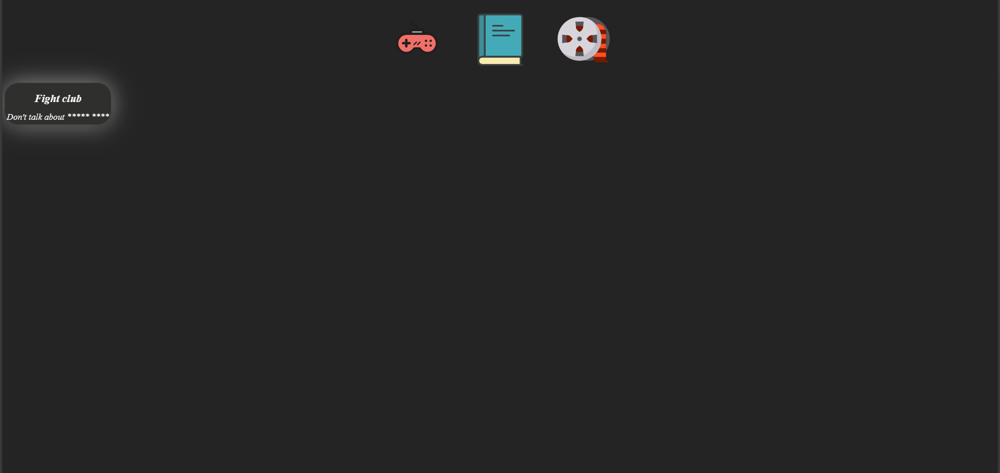

# Boredom Killer

## Description
It's a webpage made to show recommendations of books, movies, games to increase your cultural baggage and fill your free time with engaging experiences.

## Table of contents
- [Getting started](#getting-started)
- [Built With](#built-with)
- [License](#license)

## Getting started
There are a few steps you can follow to run the webpage in your machine.

### Prerequisites
You need to have the following softwares installed:
- **NPM:** It's a package manager for javascript. Manages code dependencies for your project.
- **Nodejs:** JavaScript runtime for server-side development.

### Installing
Here's a breakdown of how you can install the project in your computer:
1. **Clone:** clone the repository.
2. **Install dependencies:** you can install the dependencies by running the command `npm install` in the project's directory.

### Running the Project
After installing the project, use the following command to run the project:
  `npm run dev`.
So, you must be able to look at the project in your browser.

## Built With
- [React](https://github.com/facebook/react)
- [Vite](https://github.com/vitejs/vite)
- [Javascript](https://pt.wikipedia.org/wiki/Javascript)
- [NPM](https://github.com/npm/cli)
- [Culture Vault](https://github.com/NotAdson/CultureVault)
- [Node.js](https://nodejs.org/en)
- [Axios](https://www.npmjs.com/package/axios)

## License
This project is licensed under the terms of the [Apache License 2.0](LICENSE.md).
